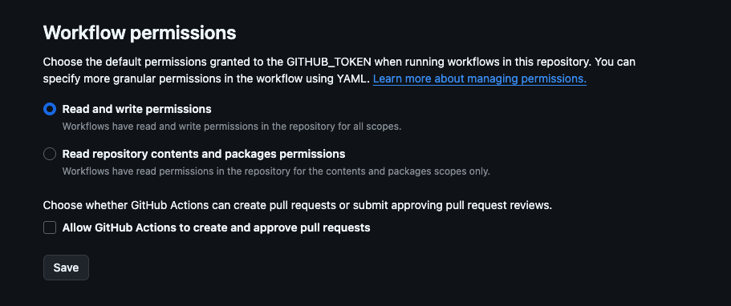

# GitHub Actions Deployment Workflow

This repository demonstrates a multi-stage deployment pipeline using GitHub Actions, as defined in [`.github/workflows/deploy.yml`](.github/workflows/deploy.yml).

## Workflow Overview

The workflow is triggered on every push to the `main` branch and consists of three jobs:

### 1. Build Job
- **Purpose:** Runs automated tests and builds the application.
- **Runs on:** `ubuntu-latest`
- **Steps:**
  - Checks out the repository code.
  - Runs test commands (replace with your actual test commands).
  - Builds the application (replace with your actual build commands).

### 2. Deploy to UAT (User Acceptance Testing)
- **Purpose:** Deploys the application to the UAT environment after a successful build.
- **Runs on:** `ubuntu-latest`
- **Depends on:** The `build` job must complete successfully.
- **Environment:** `uat` (requires manual approval if environment protection rules are set in GitHub).
- **Steps:**
  - Checks out the repository code.
  - Deploys to the UAT server (replace with your actual deployment commands, e.g., SSH, Docker, etc.).

### 3. Deploy to Production
- **Purpose:** Deploys the application to the production environment after a successful UAT deployment.
- **Runs on:** `ubuntu-latest`
- **Depends on:** The `deploy-uat` job must complete successfully.
- **Environment:** `production` (requires manual approval if environment protection rules are set in GitHub).
- **Steps:**
  - Checks out the repository code.
  - Deploys to the production server (replace with your actual deployment commands).

## Notes
- The workflow uses [GitHub Environments](https://docs.github.com/en/actions/deployment/targeting-different-environments/using-environments-for-deployment) (`uat` and `production`) for deployment jobs. You can set up environment protection rules in your repository settings to require manual approval before deployments proceed.
- Replace the placeholder commands in the workflow with your actual test, build, and deployment scripts as needed.

---

For more details, see the [deploy.yml](.github/workflows/deploy.yml) file.

## Permission Required for Pushing to uat/production Branches

To allow the workflow to push commits from `main` to the `uat` or `production` branches, the workflow must have sufficient permissions to write to these branches. By default, GitHub Actions uses the `GITHUB_TOKEN` with the following permissions:

- **contents: write** — Required to push commits to branches.
- **actions: write** — Required if the workflow triggers other workflows.

You may need to update your repository or workflow settings to ensure the `GITHUB_TOKEN` has `write` access to repository contents. For more details, see the [GitHub Actions permissions documentation](https://docs.github.com/en/actions/security-guides/automatic-token-authentication#permissions-for-the-github_token).

